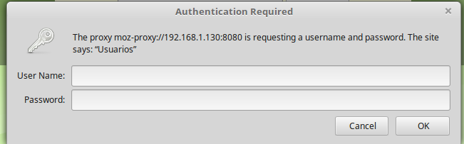

# Integrando-o-Squid-com-Ldap-usando-Cripografia

Autor: Rafaela Aparecida Pereira Paiva

Para saber mais sobre a aplicação, acesse o relatório do projeto mantido na seguinte página: [Documentação](https://raafapaiva19.gitbook.io/squid-ldap-cripto/)
